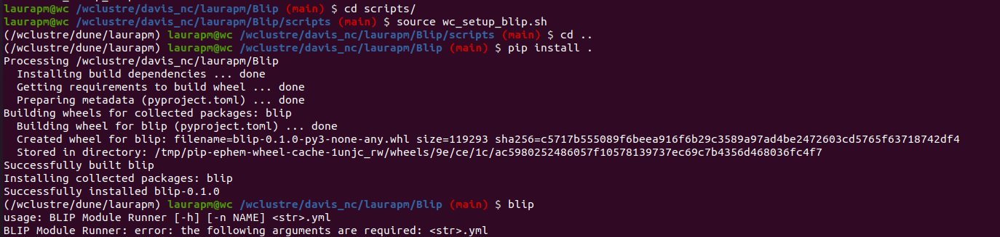

# 🚀 **BLIP**

🚧🛠️ Under construction 🛠️🚧

0. Activate the conda enviroment:

```bash
[LOCAL] conda activate blip
------------------------------------
[WILSON] cd Blip/scripts/
[WILSON] source wc_setup.sh
```

1. From the main ```Blip``` folder you need to run:

```bash
pip install .
cd ..
```




(I suggest to prepare a test dataset and config file to run the code on it and try the basis of the code.)

2.- Clone the ```BlipModels``` repository:

```bash
git clone https://github.com/Neutron-Calibration-in-DUNE/BlipModels.git
```

3.- Create a ```data``` folder 📂 where you need to allocate the ```*.root``` files you want to analyse. For the first tests you can use the ```test_data.root``` file from the ```path/```

```bash
cd BlipModels/
mkdir data
cp path/test_data.root data/
```

4.- Run ```blip``` over your files:

```bash 
blip config/config_test.yaml
```

```{toctree}
:maxdepth: 1

1.1.BlipDisplay
1.2.ConfigurationFiles
1.3.CustomModules
```