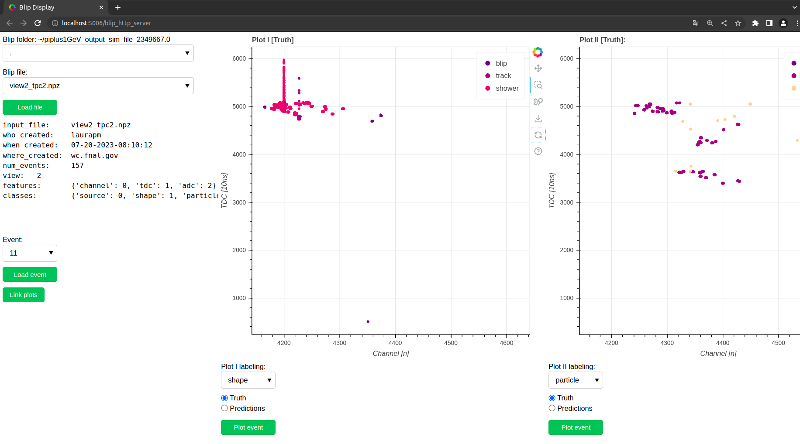

# 🖼️ **BLIP DISPLAY**

🚧🛠️ Under construction 🛠️🚧

With the conda enviromente activated you have two options to run the event display:

 - Option 1: open a ```jupyter notebook```:
```bash
jupyter notebook
```
And once open in a browser you can open the ```notebooks/blip_event_display.ipynb``` notebook and execute it.

 - Option 2: open a ```http_server```:
```bash
bokeh serve --show blip/utils/event_display/blip_http_server.py
```

The expected output should look like this:



