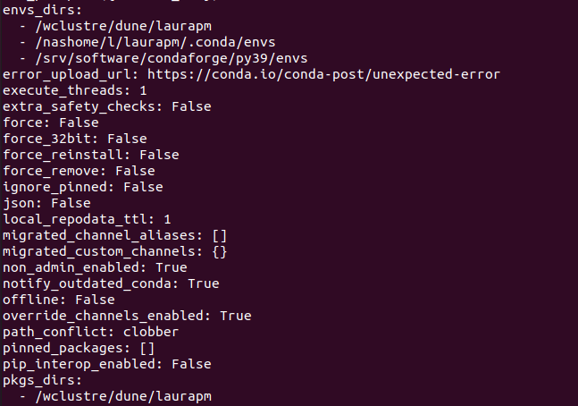
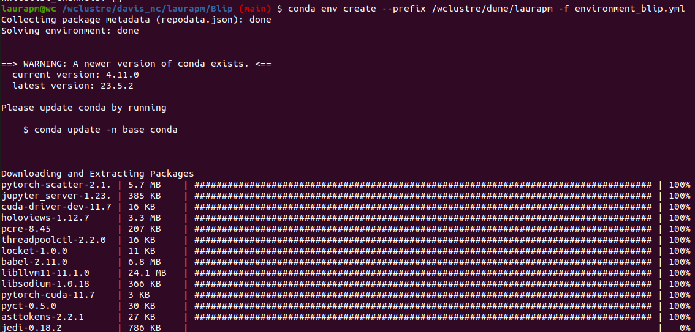
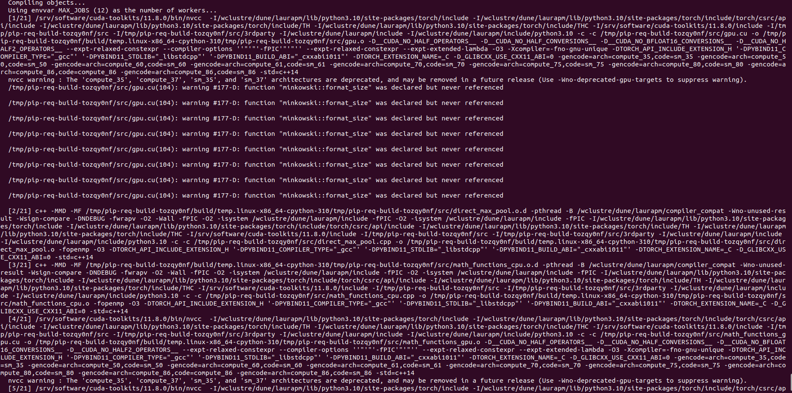
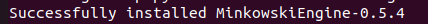

# 🚀 **BLIP**

## Installation

### Locally

1.- Clone the repository:

```bash
git clone https://github.com/Neutron-Calibration-in-DUNE/Blip.git 
```
2.- Create a conda enviroment:

```bash
conda env create -f environment_blip.yml
conda activate blip
```


3.- Install MinkoskiEngine:

```bash
sudo apt-get install libopenblas-dev
pip install -U git+https://github.com/NVIDIA/MinkowskiEngine -v --no-deps --install-option="--blas_include_dirs=${CONDA_PREFIX}/include" --install-option="--blas=openblas"
```

4.- You are done! 🎉 (Now from the main ``Blip`` folder you need to run):

```bash
pip install .
```

### Wilson Cluster

1.- Clone the repository and load the modules:

```bash
git clone https://github.com/Neutron-Calibration-in-DUNE/Blip.git 

module load gnu8/8.3.0
module load openblas/0.3.7
module load cuda11/11.8.0
module load condaforge/py39
```

2.- Create a conda enviroment:

Configure the paths:

```bash
conda config --show #check the variables envs_dirs + pkgs_dirs
conda config --add pkgs_dirs <package_directory>
conda config --add envs_dirs <enviroment_directory>
```
The output when running ```conda config --show``` again should be similar to:


If you have mistaken your path you can: ``conda config --remove envs_dirs <old_env_directory>``

Create the enviroment:

```bash
cd Blip/
conda env create --prefix /wclustre/davis_nc/USER/ -f environment_blip.yml
conda activate /wclustre/davis_nc/USER/
```



3.- Install MinkoskiEngine:

```bash
export TORCH_CUDA_ARCH_LIST="3.5;5.0;6.0;6.1;7.0;7.5;8.0;8.6+PTX"
conda install openblas
pip install -U git+https://github.com/NVIDIA/MinkowskiEngine -v --no-deps --install-option="--blas_include_dirs=${CONDA_PREFIX}/include" --install-option="--blas=openblas" --install-option="--force_cuda"
```
A long list of packages is going to be installed, if something similar to the following appears, it is going well.



When you reach the end of the installation you should see a success message, and you are done! 🎉




## Usage

🚧🛠️ Under construction 🛠️🚧

0. Activate the conda enviroment:

```bash
[LOCAL] conda activate blip
------------------------------------
[WILSON] cd Blip/scripts/
[WILSON] source wc_setup.sh
```

1. From the main ```Blip``` folder you need to run:

```bash
pip install .
cd ..
```


(I suggest to prepare a test dataset and config file to run the code on it and try the basis of the code.)

2.- Clone the ```BlipModels``` repository:

```bash
git clone https://github.com/Neutron-Calibration-in-DUNE/BlipModels.git
```

3.- Create a ```data``` folder 📂 where you need to allocate the ```*.root``` files you want to analyse. For the first tests you can use the ```test_data.root``` file from the ```path/```

```bash
cd BlipModels/
mkdir data
cp path/test_data.root data/
```

4.- Run ```blip``` over your files:

```bash 
blip config/config_test.yaml
```


### Event Display

With the conda enviromente activated you have two options to run the event display:

 - Option 1: open a ```jupyter notebook```:
```bash
jupyter notebook
```
And once open in a browser you can open the ```notebooks/blip_event_display.ipynb``` notebook and execute it.

 - Option 2: open a ```http_server```:
```bash
bokeh serve --show blip/utils/event_display/blip_http_server.py
```

The expected output should look like this:


### Modules
